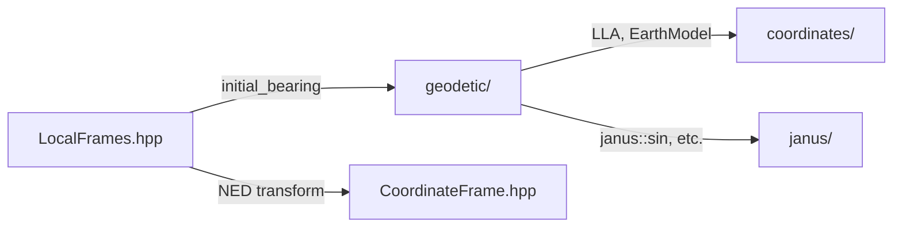

# Phase 12: Geodetic Utilities Implementation Plan

## Overview

Phase 12 adds geodetic utility functions for pure geometric computations on the WGS84 ellipsoid, plus the CDA (Cross-range, Down-range, Altitude) trajectory-relative coordinate frame. These are stateless functions that complement the existing `Geodetic.hpp` module (LLA↔ECEF conversions).

**Module locations**:
- `include/vulcan/geodetic/` — Geodesic utilities (new directory)
- `include/vulcan/coordinates/LocalFrames.hpp` — CDA frame (extend existing)

**Dependencies**:


---

## User Review Required

> [!IMPORTANT]
> **Vincenty vs Karney Decision**: The Vincenty algorithm (1975) is proposed for geodesic calculations. While accurate to 0.5mm for most cases, it can fail to converge for nearly antipodal points. The Karney algorithm (2013) from GeographicLib is more robust but significantly more complex. Recommend Vincenty with a `max_iterations` parameter and exception on non-convergence.

> [!NOTE]
> **Haversine Alternative**: A fast `haversine_distance()` function will be provided for short distances (<100km) where spherical approximation is acceptable (error <0.3%).

---

## Proposed Changes

### New Geodetic Module

#### [NEW] [GeodesicUtils.hpp](file:///home/tanged/sources/temp/vulcan/include/vulcan/geodetic/GeodesicUtils.hpp)

Core geodetic computations on the WGS84 ellipsoid:

```cpp
namespace vulcan::geodetic {

// =============================================================================
// Distance Calculations
// =============================================================================

/// Great-circle distance using Vincenty formula (accurate to 0.5mm)
/// @param lla1 First point (lon, lat, alt ignored)
/// @param lla2 Second point (lon, lat, alt ignored)
/// @param m Earth model (default: WGS84)
/// @return Distance along ellipsoid surface [m]
template <typename Scalar>
Scalar great_circle_distance(const LLA<Scalar>& lla1, const LLA<Scalar>& lla2,
                              const EarthModel& m = EarthModel::WGS84());

/// Haversine distance (fast spherical approximation)
/// Good for short distances (<100km), error <0.3%
/// @param lla1 First point
/// @param lla2 Second point
/// @param radius Sphere radius (default: WGS84 mean radius)
/// @return Distance along sphere surface [m]
template <typename Scalar>
Scalar haversine_distance(const LLA<Scalar>& lla1, const LLA<Scalar>& lla2,
                          double radius = constants::earth::R_mean);

// =============================================================================
// Bearing Calculations
// =============================================================================

/// Initial bearing (azimuth) from point 1 to point 2
/// @return Azimuth in radians [0, 2π), measured clockwise from North
template <typename Scalar>
Scalar initial_bearing(const LLA<Scalar>& lla1, const LLA<Scalar>& lla2,
                       const EarthModel& m = EarthModel::WGS84());

/// Final bearing arriving at point 2 from point 1
/// @return Azimuth in radians [0, 2π), measured clockwise from North
template <typename Scalar>
Scalar final_bearing(const LLA<Scalar>& lla1, const LLA<Scalar>& lla2,
                     const EarthModel& m = EarthModel::WGS84());

// =============================================================================
// Direct Geodesic Problem
// =============================================================================

/// Compute destination point given start, bearing, and distance
/// (Vincenty direct formula)
/// @param lla Starting point
/// @param bearing Initial azimuth [rad]
/// @param distance Distance along ellipsoid [m]
/// @param m Earth model (default: WGS84)
/// @return Destination LLA (alt set to source altitude)
template <typename Scalar>
LLA<Scalar> destination_point(const LLA<Scalar>& lla, const Scalar& bearing,
                               const Scalar& distance,
                               const EarthModel& m = EarthModel::WGS84());

// =============================================================================
// Horizon & Visibility
// =============================================================================

/// Distance to geometric horizon from given altitude
/// @param altitude Height above ellipsoid [m]
/// @param m Earth model (default: WGS84)
/// @return Distance to horizon along surface [m]
template <typename Scalar>
Scalar horizon_distance(const Scalar& altitude,
                        const EarthModel& m = EarthModel::WGS84());

/// Check if target is visible from observer (no terrain, pure geometry)
/// Uses great-circle arc vs horizon distance comparison
/// @param lla_observer Observer position
/// @param lla_target Target position
/// @param m Earth model (default: WGS84)
/// @return true if line-of-sight exists above ellipsoid
template <typename Scalar>
Scalar is_visible(const LLA<Scalar>& lla_observer, const LLA<Scalar>& lla_target,
                  const EarthModel& m = EarthModel::WGS84());

// =============================================================================
// Ray-Ellipsoid Intersection
// =============================================================================

/// Result of ray-ellipsoid intersection
template <typename Scalar>
struct RayIntersection {
    bool hit;              ///< True if ray intersects ellipsoid
    Scalar t_near;         ///< Parameter for near intersection point
    Scalar t_far;          ///< Parameter for far intersection point
    Vec3<Scalar> point_near; ///< Near intersection point (ECEF)
    Vec3<Scalar> point_far;  ///< Far intersection point (ECEF)
};

/// Ray-ellipsoid intersection for terrain/visibility calculations
/// Computes intersection of ray with WGS84 ellipsoid
/// @param origin Ray origin in ECEF [m]
/// @param direction Ray direction (will be normalized)
/// @param m Earth model (default: WGS84)
/// @return RayIntersection with up to two intersection points
template <typename Scalar>
RayIntersection<Scalar> ray_ellipsoid_intersection(
    const Vec3<Scalar>& origin, const Vec3<Scalar>& direction,
    const EarthModel& m = EarthModel::WGS84());

} // namespace vulcan::geodetic
```

---

### CDA Frame (Cross-range, Down-range, Altitude)

The CDA frame is a trajectory-relative local tangent plane coordinate system commonly used in missile guidance, reentry vehicle tracking, and range safety analysis.

**Frame Definition:**
- **Down-range (D)**: Along the trajectory ground track (initial bearing direction)
- **Cross-range (C)**: Perpendicular to ground track (right-hand rule, typically right of D)
- **Altitude (A)**: Up from the ellipsoid surface (same as ENU Z-axis)

#### [MODIFY] [LocalFrames.hpp](file:///home/tanged/sources/temp/vulcan/include/vulcan/coordinates/LocalFrames.hpp)

Add CDA frame construction functions:

```cpp
// =============================================================================
// CDA Frame (Cross-range, Down-range, Altitude) — Trajectory-Relative
// =============================================================================

/// Create CDA frame at a given position oriented toward a target
///
/// The CDA frame is a trajectory-relative local tangent plane:
/// - D-axis (X): Down-range, along great-circle bearing toward target
/// - C-axis (Y): Cross-range, perpendicular to down-range (right-hand)
/// - A-axis (Z): Altitude, up from ellipsoid surface
///
/// This is commonly used for impact prediction and range safety.
///
/// @tparam Scalar Scalar type (double for numeric, SymbolicScalar for symbolic)
/// @param lla_origin Origin position (launch point / current position)
/// @param lla_target Target position (defines down-range direction)
/// @param m Earth model (default: WGS84)
/// @return CDA frame expressed in ECEF
template <typename Scalar>
CoordinateFrame<Scalar> local_cda(const LLA<Scalar>& lla_origin,
                                   const LLA<Scalar>& lla_target,
                                   const EarthModel& m = EarthModel::WGS84());

/// Create CDA frame at a given position with specified bearing
///
/// Alternative constructor when the down-range direction is known
/// as a bearing rather than a target point.
///
/// @tparam Scalar Scalar type (double for numeric, SymbolicScalar for symbolic)
/// @param lla_origin Origin position
/// @param bearing Down-range bearing [rad], clockwise from North
/// @param m Earth model (default: WGS84)
/// @return CDA frame expressed in ECEF
template <typename Scalar>
CoordinateFrame<Scalar> local_cda(const LLA<Scalar>& lla_origin,
                                   const Scalar& bearing,
                                   const EarthModel& m = EarthModel::WGS84());

/// Create CDA frame at a given ECEF position with bearing
///
/// Convenience overload that takes ECEF position.
///
/// @param r_ecef Position in ECEF [m]
/// @param bearing Down-range bearing [rad], clockwise from North
/// @param m Earth model (default: WGS84)
/// @return CDA frame expressed in ECEF
template <typename Scalar>
CoordinateFrame<Scalar> local_cda_at(const Vec3<Scalar>& r_ecef,
                                      const Scalar& bearing,
                                      const EarthModel& m = EarthModel::WGS84());

// =============================================================================
// CDA Coordinate Conversions
// =============================================================================

/// Convert ECEF position to CDA coordinates relative to reference
///
/// @param r_ecef Position to convert (ECEF) [m]
/// @param lla_ref Reference point (origin of CDA frame)
/// @param bearing Down-range bearing [rad]
/// @param m Earth model (default: WGS84)
/// @return Vec3 with (cross-range, down-range, altitude) [m]
template <typename Scalar>
Vec3<Scalar> ecef_to_cda(const Vec3<Scalar>& r_ecef,
                          const LLA<Scalar>& lla_ref,
                          const Scalar& bearing,
                          const EarthModel& m = EarthModel::WGS84());

/// Convert CDA coordinates to ECEF position
///
/// @param cda CDA coordinates (cross-range, down-range, altitude) [m]
/// @param lla_ref Reference point (origin of CDA frame)
/// @param bearing Down-range bearing [rad]
/// @param m Earth model (default: WGS84)
/// @return Position in ECEF [m]
template <typename Scalar>
Vec3<Scalar> cda_to_ecef(const Vec3<Scalar>& cda,
                          const LLA<Scalar>& lla_ref,
                          const Scalar& bearing,
                          const EarthModel& m = EarthModel::WGS84());
```

**Implementation Notes:**
- CDA frame is constructed by rotating the local NED frame about the Up axis by the bearing angle
- Down-range becomes the X-axis (formerly North, rotated by bearing)
- Cross-range becomes the Y-axis (perpendicular, right-hand rule)
- Altitude remains the Z-axis (same as ENU Up)

---

### Header Aggregation

#### [MODIFY] [vulcan.hpp](file:///home/tanged/sources/temp/vulcan/include/vulcan/vulcan.hpp)

Add geodetic include:
```cpp
#include <vulcan/geodetic/GeodesicUtils.hpp>
```

---


### Tests

#### [NEW] [test_geodetic_utils.cpp](file:///home/tanged/sources/temp/vulcan/tests/geodetic/test_geodetic_utils.cpp)

| Test Case | Description | Reference |
|-----------|-------------|-----------|
| `VincentyDistance_LondonToNewYork` | NYC–London = 5570.222 km | GeographicLib |
| `VincentyDistance_ShortDistance` | 1 km test | Validates precision |
| `VincentyDistance_Antipodal` | Sydney–Quito | Near-antipodal edge case |
| `VincentyDistance_SamePoint` | d=0 when lla1==lla2 | Edge case |
| `HaversineDistance_Accuracy` | Compare to Vincenty | Error <0.3% for short |
| `InitialBearing_EastWest` | Due East = 90° | Cardinal directions |
| `FinalBearing_GreatCircle` | Non-rhumb bearing change | Curvature effect |
| `DestinationPoint_Roundtrip` | start→dest→start | Consistency |
| `HorizonDistance_SealLevel` | 0m alt → 0m horizon | Boundary |
| `HorizonDistance_Aircraft` | 10km alt ≈ 357 km | Realistic scenario |
| `RayEllipsoid_VerticalDown` | Observer above surface | Must hit |
| `RayEllipsoid_Tangent` | Grazing ray | Edge case |
| `RayEllipsoid_Miss` | Ray pointing away | No hit |
| `IsVisible_SameSide` | Two close points | Visible |
| `IsVisible_Horizon` | Just at horizon limit | Boundary |
| `Symbolic_Distance` | CasADi graph builds | Janus compatibility |
| `Symbolic_Bearing` | CasADi graph builds | Janus compatibility |

#### CDA Frame Tests

| Test Case | Description | Reference |
|-----------|-------------|-----------|
| `CDA_FromBearing_North` | bearing=0 → D=North, C=East | NED alignment |
| `CDA_FromBearing_East` | bearing=π/2 → D=East, C=South | 90° rotation |
| `CDA_FromTarget` | Bearing computed correctly | Uses initial_bearing |
| `CDA_Roundtrip_ECEF` | ecef→cda→ecef identity | Numerical stability |
| `CDA_DownRange_Distance` | Point on bearing = (0, d, 0) | Geometry check |
| `CDA_CrossRange_Offset` | Point perpendicular = (c, 0, 0) | Geometry check |
| `CDA_Altitude_Preserved` | Altitude consistent with LLA | Vertical axis |
| `CDA_Symbolic_Frame` | CasADi graph builds | Janus compatibility |

#### [MODIFY] [CMakeLists.txt](file:///home/tanged/sources/temp/vulcan/tests/CMakeLists.txt)

Add geodetic test executable:
```cmake
# Geodetic utilities tests
add_executable(test_geodetic_utils
    geodetic/test_geodetic_utils.cpp
)
target_link_libraries(test_geodetic_utils PRIVATE vulcan GTest::gtest_main)
gtest_discover_tests(test_geodetic_utils)
```

---

## Algorithm References

### Vincenty Formula (Inverse)
Source: Vincenty, T. (1975). "Direct and inverse solutions of geodesics on the ellipsoid with application of nested equations"

The iterative inverse formula solves:
```
tan U₁ = (1-f) tan φ₁
tan U₂ = (1-f) tan φ₂
λ = L  (initial guess)

Iterate until convergence:
  sin σ = √((cos U₂ sin λ)² + (cos U₁ sin U₂ - sin U₁ cos U₂ cos λ)²)
  cos σ = sin U₁ sin U₂ + cos U₁ cos U₂ cos λ
  σ = atan2(sin σ, cos σ)
  sin α = cos U₁ cos U₂ sin λ / sin σ
  cos²α = 1 - sin²α
  cos 2σₘ = cos σ - 2 sin U₁ sin U₂ / cos²α
  C = f/16 cos²α (4 + f(4 - 3 cos²α))
  λ' = L + (1-C) f sin α (σ + C sin σ (cos 2σₘ + C cos σ (-1 + 2 cos² 2σₘ)))

Distance: s = b A (σ - Δσ)
```

### Horizon Distance
Simple geometric derivation:
```
d = √(2Rh + h²) ≈ √(2Rh) for small h

For ellipsoid, use mean radius at observer latitude.
```

### Ray-Ellipsoid Intersection
Quadratic solution for:
```
(x/a)² + (y/a)² + (z/b)² = 1

Substitute: P = O + t·D
Solve: At² + Bt + C = 0
```

---

## Verification Plan

### Automated Tests
```bash
# Build and run all tests
./scripts/ci.sh

# Run only geodetic tests
./scripts/dev.sh
cd build && ctest -R test_geodetic_utils --verbose
```

### Reference Validation
- Compare Vincenty distances against GeographicLib's `geod` tool
- Cross-validate with: https://www.movable-type.co.uk/scripts/latlong-vincenty.html
- Verify against published textbook values (Vallado 4th ed., p.158-159)

### Symbolic Backend Validation
Test that all functions generate valid CasADi computational graphs:
```cpp
TEST(GeodesicSymbolic, Distance_GraphBuilds) {
    auto lon1 = casadi::MX::sym("lon1");
    auto lat1 = casadi::MX::sym("lat1");
    auto lon2 = casadi::MX::sym("lon2");
    auto lat2 = casadi::MX::sym("lat2");
    
    LLA<casadi::MX> p1(lon1, lat1, casadi::MX(0));
    LLA<casadi::MX> p2(lon2, lat2, casadi::MX(0));
    
    auto d = vulcan::geodetic::haversine_distance(p1, p2);
    EXPECT_FALSE(d.is_empty());
}
```

> [!NOTE]
> The Vincenty iterative algorithm requires special handling for symbolic mode—likely providing a fixed iteration count rather than convergence checking. This will be documented in code comments.
